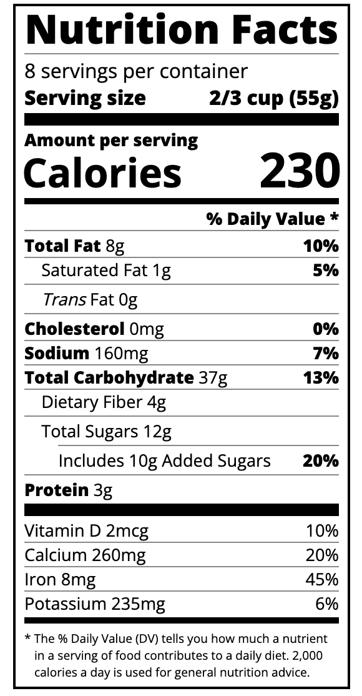

# Nutrition-label

## Description

This was a freeCodeCamp Challenge I have completed to learn typography.

Typography is the art of styling your text to be easily readable and suit its purpose.

## Screenshot

The following image shows Nutrition label appearance:

## Getting Started

The following link will take you to live [Nutrition Label](https://cyberrie.github.io/nutrition-label/)
